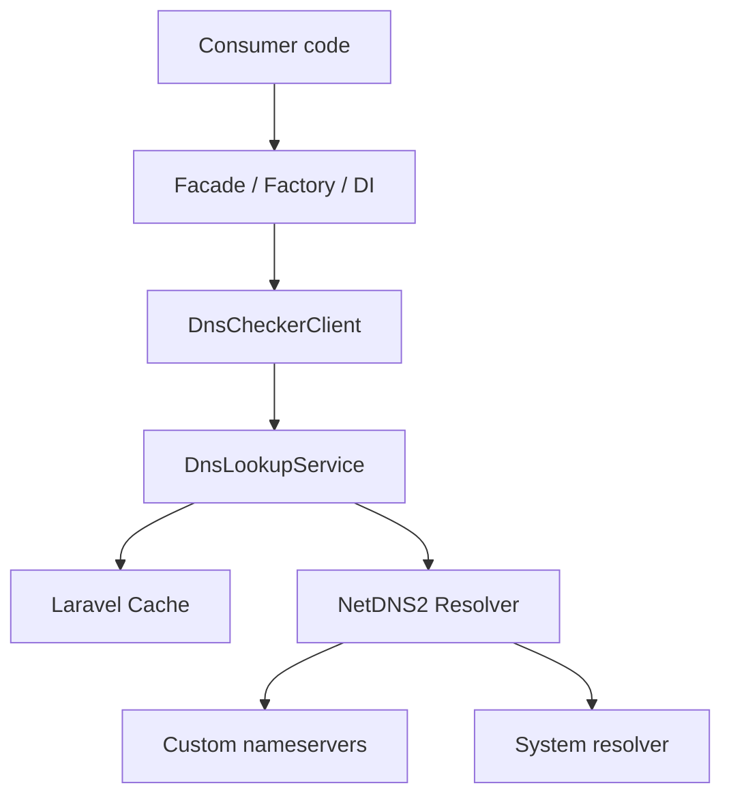
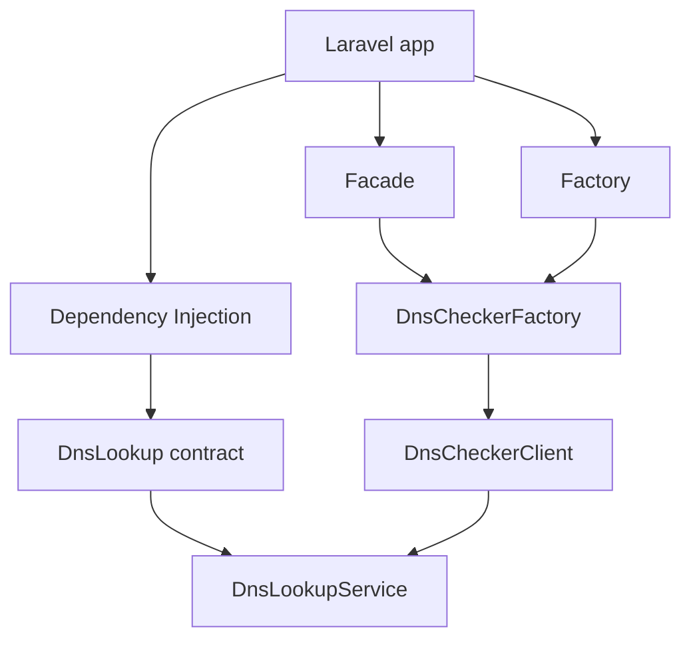

# Architecture

## Component Overview

```mermaid
flowchart TB
    A[Consumer code] --> B[Facade / Factory / DI]
    B --> C[DnsCheckerClient]
    C --> D[DnsLookupService]
    D --> E[Laravel Cache]
    D --> F[NetDNS2 Resolver]
    F --> G[Custom nameservers]
    F --> H[System resolver]
```

## Laravel Integration Paths

```mermaid
flowchart TB
    A[Laravel app] --> B[Facade]
    A --> C[Dependency Injection]
    A --> D[Factory]
    B --> E[DnsCheckerFactory]
    C --> F[DnsLookup contract]
    D --> E
    E --> G[DnsCheckerClient]
    F --> H[DnsLookupService]
    G --> H
```
