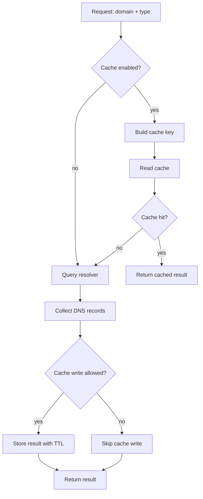

# Caching

## Cache Flow



## Laravel Cache Example

If Redis is your default Laravel cache driver, just enable caching and keep `store=null`:

```php
// config/dns-checker.php
return [
    // ...
    'cache' => [
        'enabled' => true,
        'store' => null,
        'ttl' => 60,
        'prefix' => 'dns-checker',
        'cache_empty' => false,
    ],
];
```

To pin a specific store:

```php
'cache' => [
    'enabled' => true,
    'store' => 'redis', // or 'file' / 'database' / 'memcached'
    'ttl' => 60,
],
```

## Notes

- This is an outer cache for DNS query results.
- It uses Laravel Cache stores such as Redis, file, database, or Memcached.
- It does not rely on NetDNS2 file/shmop cache internals.
- `cache_empty=true` allows caching empty NOERROR/NODATA responses.
- Exceptions are not cached.
