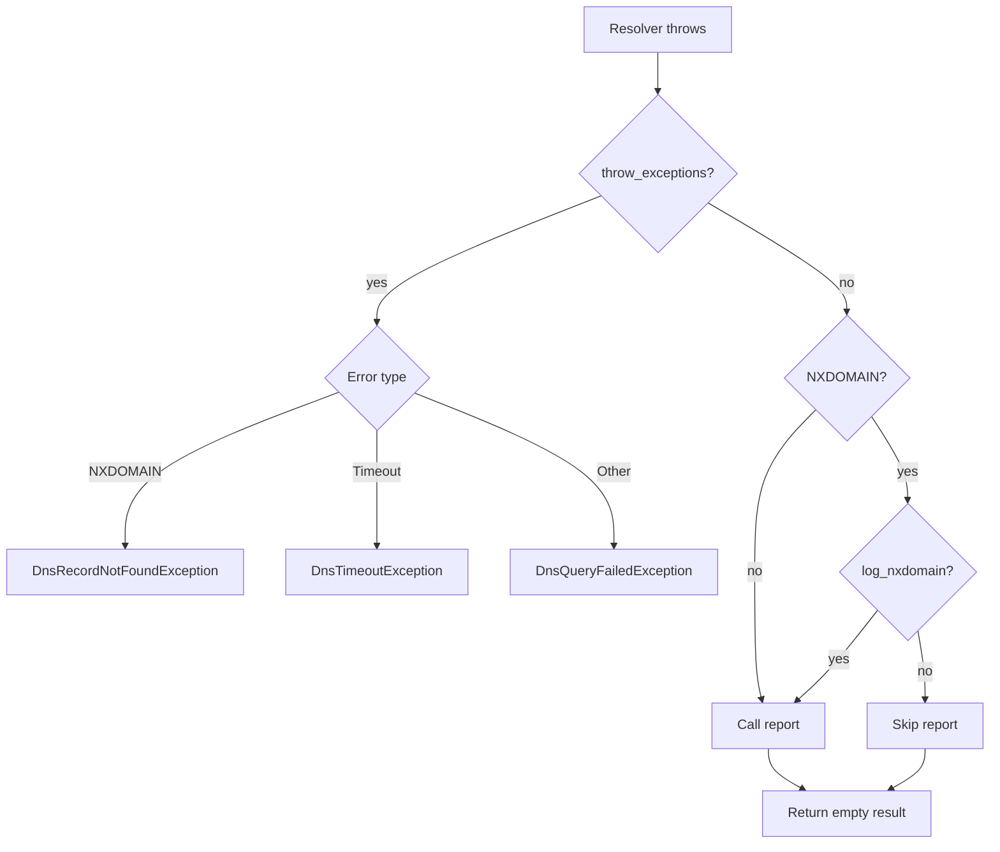

# Error Handling

## Error Handling Flow



By default (`throw_exceptions=false`) errors result in an empty array:

```php
$records = $dns->getRecords('does-not-exist.example', 'A'); // []
```

With `throw_exceptions=true`, you can use `try/catch`:

```php
use Alyakin\DnsChecker\Exceptions\DnsQueryFailedException;
use Alyakin\DnsChecker\Exceptions\DnsRecordNotFoundException;
use Alyakin\DnsChecker\Exceptions\DnsTimeoutException;

try {
    $records = $dns->getRecords('does-not-exist.example', 'A');
} catch (DnsRecordNotFoundException $e) {
    // NXDOMAIN
} catch (DnsTimeoutException $e) {
    // timeout
} catch (DnsQueryFailedException $e) {
    // other DNS errors
}
```

## Behavior Notes

- If custom `servers` are configured, they are tried first.
- If no records are returned and `fallback_to_system=true`, the system resolver is queried next.
- Invalid domains return an empty result before any resolver call.
- With `throw_exceptions=false`, lookup failures return `[]`.
- With `throw_exceptions=true`, failures are mapped to typed exceptions.
- `log_nxdomain` controls whether NXDOMAIN failures are reported when exceptions are disabled.
