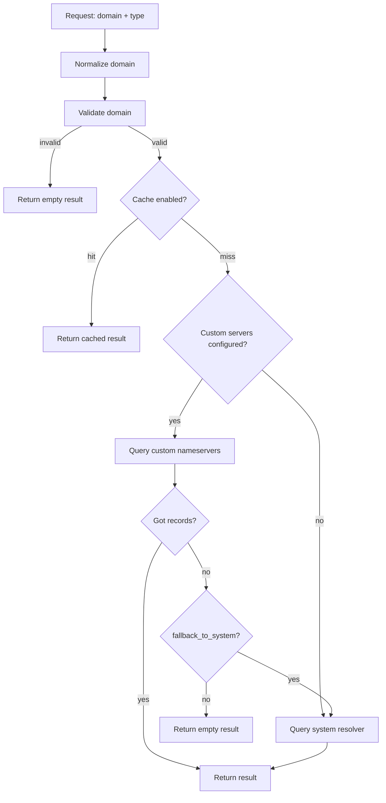

# Usage

## Request Flow



## Plain Usage

```php
use Alyakin\DnsChecker\DnsLookupService;

$dns = new DnsLookupService(config('dns-checker'));

$ips = $dns->getRecords('example.com');        // A records
$txt = $dns->getRecords('example.com', 'TXT'); // TXT records
```

If you are not in Laravel, pass the config array directly:

```php
use Alyakin\DnsChecker\DnsLookupService;

$dns = new DnsLookupService([
    'servers' => ['8.8.8.8'],
    'timeout' => 2,
]);
```

## Laravel vs Plain PHP

| Feature | Laravel | Plain PHP |
|---|---|---|
| Service provider auto-discovery | Yes | No |
| Facade | Yes | No |
| Dependency injection contract | Yes | No |
| Artisan command | Yes | No |
| Laravel Cache integration | Yes | No |
| Direct `DnsLookupService` usage | Yes | Yes |

## Facade (Laravel)

```php
use Alyakin\DnsChecker\Facades\DnsChecker;

$ips = DnsChecker::getRecords('example.com', 'A');
```

## Fluent API (Laravel)

```php
use Alyakin\DnsChecker\Facades\DnsChecker;

$result = DnsChecker::usingServer('8.8.8.8')
    ->withTimeout(5)
    ->query('example.com', 'TXT');
```

Notes:
- `usingServer()` overrides `servers` for this call; it will not try other configured servers.
- System fallback may still happen if `fallback_to_system=true`.

## Dependency Injection (Laravel)

```php
use Alyakin\DnsChecker\Contracts\DnsLookup;

final class SomeJob
{
    public function handle(DnsLookup $dns): void
    {
        $ips = $dns->getRecords('example.com', 'A');
    }
}
```

## CLI (Laravel)

```bash
php artisan dns:check example.com A
```
